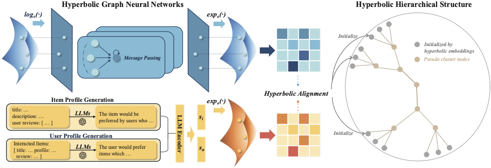

# HARec: Hyperbolic Graph-LLM Alignment for Exploration and Exploitation in Recommender Systems

PyTorch implementation for [HARec: Hyperbolic Graph-LLM Alignment for Exploration and Exploitation in Recommender Systems](https://arxiv.org/abs/2411.13865)

> **HARec: Hyperbolic Graph-LLM Alignment for Exploration and Exploitation in Recommender Systems**\
> Qiyao Ma, Menglin Yang, Mingxuan Ju, Tong Zhao, Neil Shah, Rex Ying\
> *arXiv 2024*

-----
This paper presents HARec, a hyperbolic representation learning framework that jointly aligns user-item collaborative information with textual descriptions in hyperbolic space. Our framework introduces two key technique novelty: (1) a hyperbolic hierarchical-aware graph-LLM alignment mechanism that enables better embedding representation, and (2) a hyperbolic hierarchical tree structure that facilitates user-adjustable exploration-exploitation trade-offs.

<p align="center">

</p>

## Environment

Run the following command to install dependencies:

```
pip install -r requirements.txt
```

## Usage

Before running the following commands, please make sure you have downloaded the [datasets](https://drive.google.com/drive/folders/18RmXeLmc3mJVkgMn8v9sOcxmffXWOU5C?usp=share_link) and put them in the `data` folder. The supported datasets are: `amazon`, `google`, `yelp`. Please note that each of the following commands can be executed independently, as all the necessary files have been provided.

**Hyperbolic Graph-LLM Alignment Model:**
- To train the hyperbolic alignment model:
    ```
    python recommend.py --mode train --dataset {dataset}
    ```
- To test the utility (Recall & NDCG) performance of hyperbolic embeddings:
    ```
    python recommend.py --mode test --dataset {dataset}
    ```
**Hyperbolic Hierarchical Structure:**
- To build the hierarchical tree structure:
    ```
    python hierarchy.py --mode build --dataset {dataset}
    ```
- To evaluate both the utility and diversity performance of hyperbolic embeddings:
    ```
    python hierarchy.py --mode evaluate --dataset {dataset}
    ```
- To manually balance the exploration-exploitation trade-off:
    ```
    python hierarchy.py --mode balance --dataset {dataset} --temperature {0-1} --layer {1-10}
    ```
**Profile Decoder:** 
Prepare your Hugging Face user access token for downloading Llama 3 model.
- To finetune the profile decoder:
    ```
    python decoder/main.py --mode finetune --dataset {dataset}
    ```
- To reconstruct user/item profile:
    ```
    python decoder/main.py --mode generate --dataset {dataset}
    ```
- To evaluate the profile decoder:
    ```
    python decoder/main.py --mode evaluate --dataset {dataset}
    ```


## Code Structure
```
┌── README.md
├── data (amazon/yelp/google)
│   ├── user_item_list.pkl                # user-item interactions
│   ├── train/valid/test.pkl              # separation of user_item_list.pkl
│   ├── {usr/itm}_prf.pkl                 # generated user/item profile
│   ├── {user/item}_sementic_embed.pkl    # Euclidean user/item profile embeddings
│   ├── {user/item}_embed.pkl             # hyperbolic user/item embeddings
│   ├── prediction.pkl                    # predicted recommendation
│   ├── {user/item}_converter.pkl         # converter to reconstruct user/item profile
│   ├── profile_{ref/pref}.pkl            # origin/decoded user/item profile
│   └── hierarchy_tree.pkl                # hierarchical tree structure
├── decoder
│   ├── utils
│   ├── decoder.py                        # profile decoder model
│   ├── evaluater.py                      # evaluation metrics      
│   └── main.py                           
├── models                      
│   ├── align.py                          # hyperbolic alignment model
│   ├── balance.py                        # balance exploration-exploitation trade-off 
│   └── clustering.py                     # build the hyperbolic hierarchical tree
├── utils          
├── rgd                                   # Riemannian gradient descent optimizer
├── manifolds                             # hyperbolic manifolds
├── hierarchy.py
└── recommend.py
```

## Citation

If you find HARec helpful to your research or applications, please kindly cite:

```bibtex
@article{ma2024harec,
  title={HARec: Hyperbolic Graph-LLM Alignment for Exploration and Exploitation in Recommender Systems},
  author={Ma, Qiyao and Yang, Menglin and Ju, Mingxuan and Zhao, Tong and Shah, Neil and Ying, Rex},
  journal={arXiv preprint arXiv:2411.13865},
  year={2024}
}
```